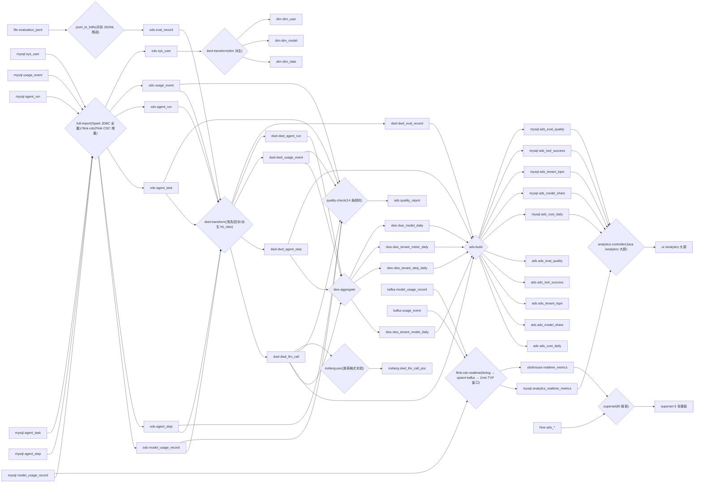

# HFusionData Analytics — 表级血缘图

由 load_lineage.py 从 lineage.yaml 渲染(11 个作业节点)。

```mermaid
flowchart LR
    j2894{"full-import(Spark JDBC 全量)/ flink-cdc(Flink CDC 增量)"}
    n1["mysql·model_usage_record"]
    n1 --> j2894
    n2["mysql·agent_step"]
    n2 --> j2894
    n3["mysql·agent_task"]
    n3 --> j2894
    n4["mysql·agent_run"]
    n4 --> j2894
    n5["mysql·usage_event"]
    n5 --> j2894
    n6["mysql·sys_user"]
    n6 --> j2894
    n7["ods·model_usage_record"]
    j2894 --> n7
    n8["ods·agent_step"]
    j2894 --> n8
    n9["ods·agent_task"]
    j2894 --> n9
    n10["ods·agent_run"]
    j2894 --> n10
    n11["ods·usage_event"]
    j2894 --> n11
    n12["ods·sys_user"]
    j2894 --> n12
    j550{"jsonl_to_hdfs(评测 JSONL 推送)"}
    n13["file·evaluation_jsonl"]
    n13 --> j550
    n14["ods·eval_record"]
    j550 --> n14
    j6073{"dwd-transform(dim 派生)"}
    n12 --> j6073
    n15["dim·dim_date"]
    j6073 --> n15
    n16["dim·dim_model"]
    j6073 --> n16
    n17["dim·dim_user"]
    j6073 --> n17
    j2447{"dwd-transform(清洗/回补/派生 hit_ratio)"}
    n7 --> j2447
    n8 --> j2447
    n9 --> j2447
    n10 --> j2447
    n11 --> j2447
    n14 --> j2447
    n18["dwd·dwd_llm_call"]
    j2447 --> n18
    n19["dwd·dwd_agent_step"]
    j2447 --> n19
    n20["dwd·dwd_usage_event"]
    j2447 --> n20
    n21["dwd·dwd_agent_run"]
    j2447 --> n21
    n22["dwd·dwd_eval_record"]
    j2447 --> n22
    j7807{"dws-aggregate"}
    n18 --> j7807
    n19 --> j7807
    n20 --> j7807
    n21 --> j7807
    n23["dws·dws_tenant_model_daily"]
    j7807 --> n23
    n24["dws·dws_tenant_step_daily"]
    j7807 --> n24
    n25["dws·dws_tenant_meter_daily"]
    j7807 --> n25
    n26["dws·dws_model_daily"]
    j7807 --> n26
    j3819{"ads-build"}
    n23 --> j3819
    n24 --> j3819
    n25 --> j3819
    n26 --> j3819
    n18 --> j3819
    n19 --> j3819
    n22 --> j3819
    n27["ads·ads_cost_daily"]
    j3819 --> n27
    n28["ads·ads_model_share"]
    j3819 --> n28
    n29["ads·ads_tenant_topn"]
    j3819 --> n29
    n30["ads·ads_tool_success"]
    j3819 --> n30
    n31["ads·ads_eval_quality"]
    j3819 --> n31
    n32["mysql·ads_cost_daily"]
    j3819 --> n32
    n33["mysql·ads_model_share"]
    j3819 --> n33
    n34["mysql·ads_tenant_topn"]
    j3819 --> n34
    n35["mysql·ads_tool_success"]
    j3819 --> n35
    n36["mysql·ads_eval_quality"]
    j3819 --> n36
    j9744{"quality-check(14 条规则)"}
    n7 --> j9744
    n8 --> j9744
    n11 --> j9744
    n9 --> j9744
    n18 --> j9744
    n20 --> j9744
    n37["ads·quality_report"]
    j9744 --> n37
    j3617{"flink-cdc-realtime(binlog → upsert-kafka → 1min TVF 窗口)"}
    n1 --> j3617
    n38["kafka·model_usage_record"]
    n38 --> j3617
    n39["kafka·usage_event"]
    n39 --> j3617
    n40["mysql·analytics_realtime_metrics"]
    j3617 --> n40
    n41["clickhouse·realtime_metrics"]
    j3617 --> n41
    j5948{"iceberg-poc(湖表格式实验)"}
    n18 --> j5948
    n42["iceberg·dwd_llm_call_poc"]
    j5948 --> n42
    j7846{"analytics-controller(Java /analytics 大屏)"}
    n32 --> j7846
    n33 --> j7846
    n34 --> j7846
    n35 --> j7846
    n36 --> j7846
    n40 --> j7846
    n43["ui·/analytics 大屏"]
    j7846 --> n43
    j7886{"superset(BI 报表)"}
    n44["hive·ads_*"]
    n44 --> j7886
    n41 --> j7886
    n45["superset·5 张看板"]
    j7886 --> n45
```
