# HFusionHub 项目介绍（功能全览）

> 面向新用户与评估者的**逐页功能导览**：每个页面做什么、怎么用，均附实际运行截图（暗色主题、1440×900）。
> 快速开始请看 [README](../README.md)；配置项全集见 [ENVIRONMENT.md](ENVIRONMENT.md)；常见问题见 [FAQ.md](FAQ.md)。

HFusionHub 是一个**企业级多租户 AI Agent 平台**：Java（Spring Boot 3，写路径与业务治理）+ Python（FastAPI，RAG/Agent 智能层）+ Vue 3（前端）三层架构，支持知识库问答（RAG）、智能对话、工具审批（Agent）、招投标垂直场景（招标解读/标书撰写/废标自检）与套餐计费。

---

## 目录

1. [登录与注册](#1-登录与注册)
2. [首页工作台](#2-首页工作台)
3. [知识与文档](#3-知识与文档)（知识库 / 详情 / 分块 / 文档 / 回收站）
4. [智能对话](#4-智能对话)
5. [投标垂直场景](#5-投标垂直场景)（投标项目 / 招标解读 / 标书撰写 / 套餐中心）
6. [AI 构建工具](#6-ai-构建工具)（我的模型 / AI 能力 / 回答方案 / 方案测试 / 回归用例 / 回答效果 / 应用发布 / MCP 服务 / 插件管理）
7. [运行与观测](#7-运行与观测)（运行记录 / 待确认操作 / 模型用量）
8. [记忆与笔记](#8-记忆与笔记)
9. [系统管理（管理员）](#9-系统管理管理员)（能力开关 / 问题分流 / 账号权限 / 公告管理 / 审计日志 / 套餐管理）
10. [设置与个人中心](#10-设置与个人中心)

---

## 1. 登录与注册

访问系统首先进入登录页。输入用户名密码登录；没有账号点击「立即注册」（注册后需管理员分配身份才能使用业务功能）；忘记密码点「忘记密码？」按提示联系管理员重置（项目未接入邮件服务）。支持企业 SSO 单点登录（服务端开启后自动显示入口）。

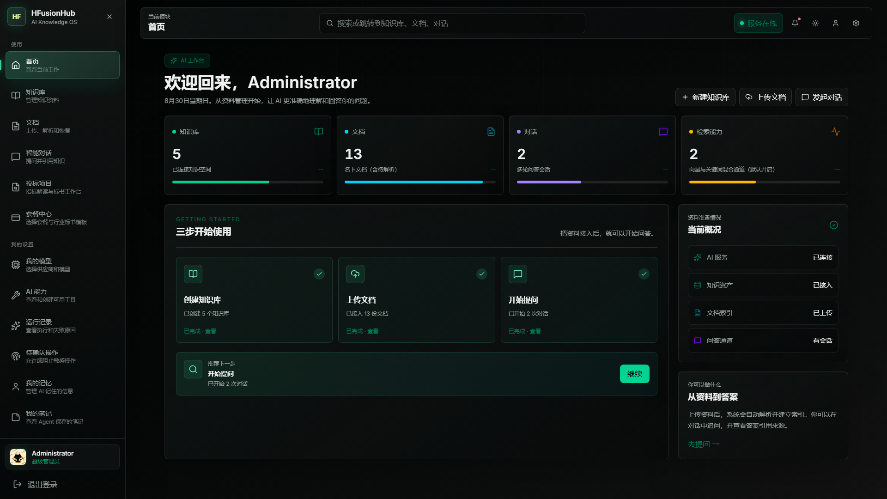

> 新用户建议路径：注册 → 管理员在「账号权限」分配身份 → 登录 → 首页点击「导入演示数据」快速体验。

## 2. 首页工作台

登录后的第一站，也是每天的 operations 中心：

- **设置引导清单**：AI 服务就绪 / 问答模型 / 创建知识库 / 发起首次对话 —— 四步检查，逐步引导完成首次配置；
- **一键导入演示数据**（仅管理员）：导入知识库文档、回答方案、笔记、记忆、应用、公告，导入后可直接提问体验全链路；
- **AI 工作台统计卡**：知识库 / 文档 / 对话数量与检索能力状态，点击卡片直达对应页面；
- **三步开始使用**：上传 → 解析 → 提问的最短路径指引。

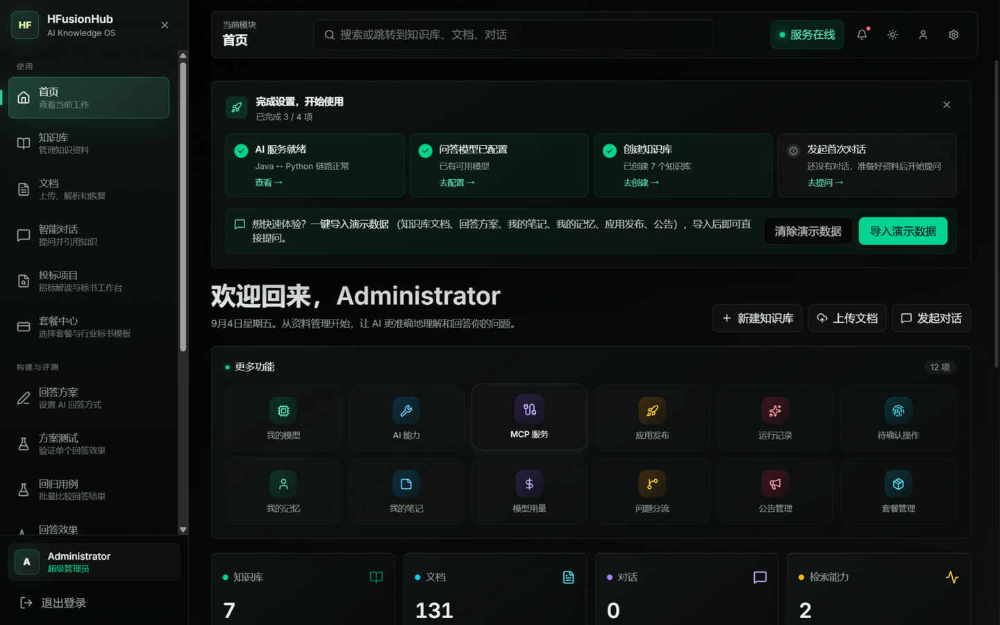

**怎么用**：新环境先看引导清单缺什么，点卡片跳转补齐；想快速看效果直接点「导入演示数据」。

## 3. 知识与文档

### 3.1 知识库列表

知识库是 RAG 的资料容器。页面支持按名称筛选、新建知识库（设置名称/描述）、进入详情、移入回收站。每个知识库显示文档数量与状态（启用/禁用，禁用后其文档不可被解析与检索）。

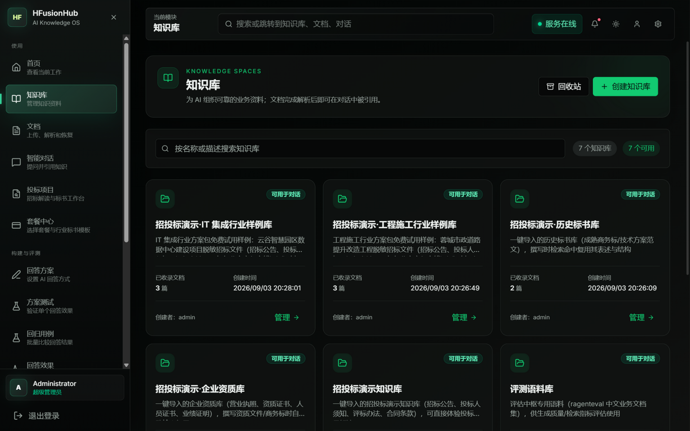

### 3.2 知识库详情

进入单个知识库后的工作区：**文档列表**（上传/解析/删除）、**分享管理**（生成共享链接给其他用户只读访问）、知识库信息编辑。推荐从这里按"知识库 → 文档"的组织方式管理资料。

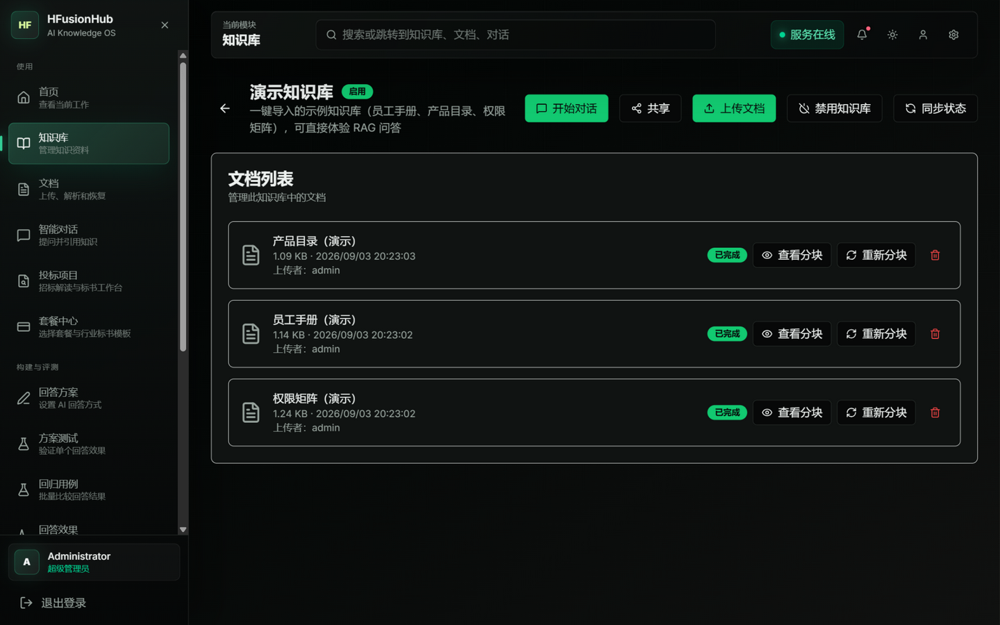

### 3.3 分块详情（解析结果查看）

文档解析完成后，内容被切成带类型标签（标题/段落/代码/表格/列表）的检索块。本页用于**核查解析质量**：

- 按类型 chip 快速筛选（可叠加知识库维度）；
- 超长分块折叠，点击展开全文；
- 每块可一键复制，左色条区分块类型，含章节路径与字符数。

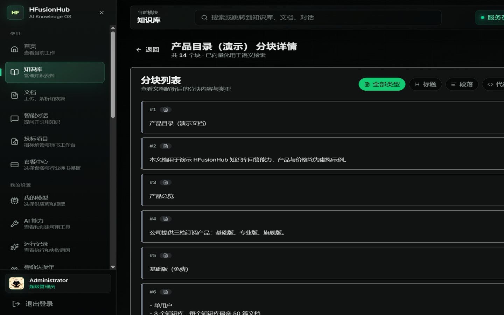

**怎么用**：文档列表 → 「查看分块」进入。若回答质量差，先来这里看切块是否合理。

### 3.4 文档管理（全局）

跨知识库的文档总览：按知识库筛选、按**解析状态**筛选（待解析/解析中/已解析/解析失败）、按名称搜索；支持多文件上传（PDF/Word/Markdown）、网页 URL 建档、「同步状态」批量刷新解析进度。每个文档按状态提供对应操作：待解析 → 开始解析；失败 → 重新解析；已完成 → 查看分块。

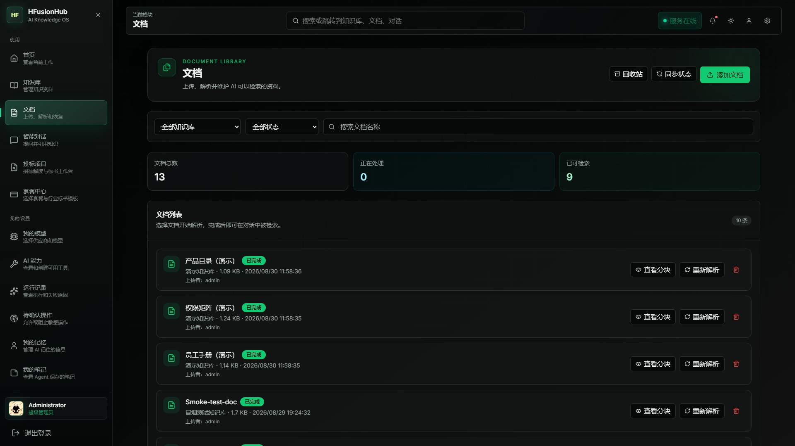

**怎么用**：「添加文档」→ 选知识库上传 → 等待解析完成（页面实时显示进度与阶段）→ 到智能对话提问。

### 3.5 回收站

删除的文档进入回收站软删除（保留 7 天可恢复），防止误删。支持单条恢复与彻底清除。

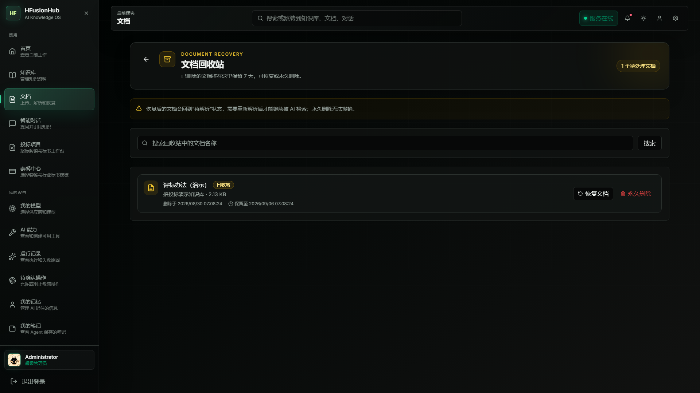

## 4. 智能对话

与 AI 交互的主入口，支持**流式输出**（逐字实时显示）与**知识库引用**（回答附带来源文档片段）。

### 4.1 对话列表

新建对话时可选择：关联知识库（AI 优先检索其中资料）、回答方案（控制语气与结构，见第 6.3 节）。空态提供示例问题引导；列表支持按名称/知识库/内容搜索与筛选。

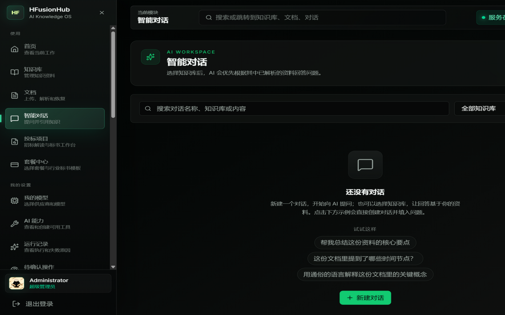

### 4.2 会话详情

多轮问答界面：流式回答、引用来源展示、每条回答可复制/重新生成/点赞点踩（反馈进入回答质量分析）。回答基于知识库时优先引用原文，不会编造资料外内容（证据不足时会明确提示）。

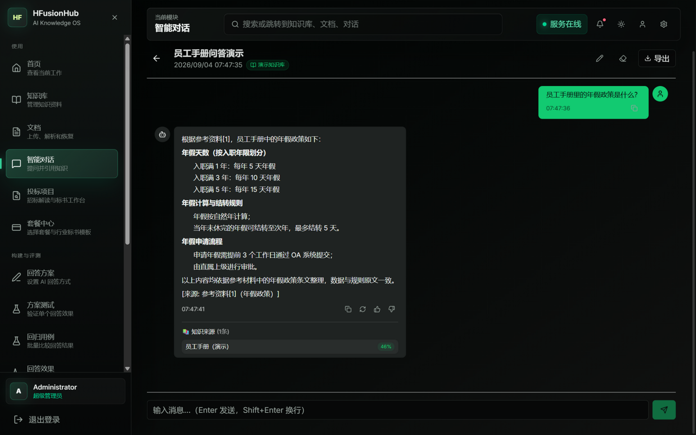

**怎么用**：新建对话 → 选知识库 → 输入问题（Enter 发送）→ 查看回答与引用；对回答不满意可重新生成或到「回答效果」页查看检索质量。

## 5. 投标垂直场景

面向招投标业务的商业化套件（部分能力需订阅套餐，见 5.4）。

### 5.1 投标项目

以"项目"为单位组织一次投标：录入招标公告（或抓取网页）后，进入解读 → 需求清单 → 标书撰写 → 废标自检的完整工作流。

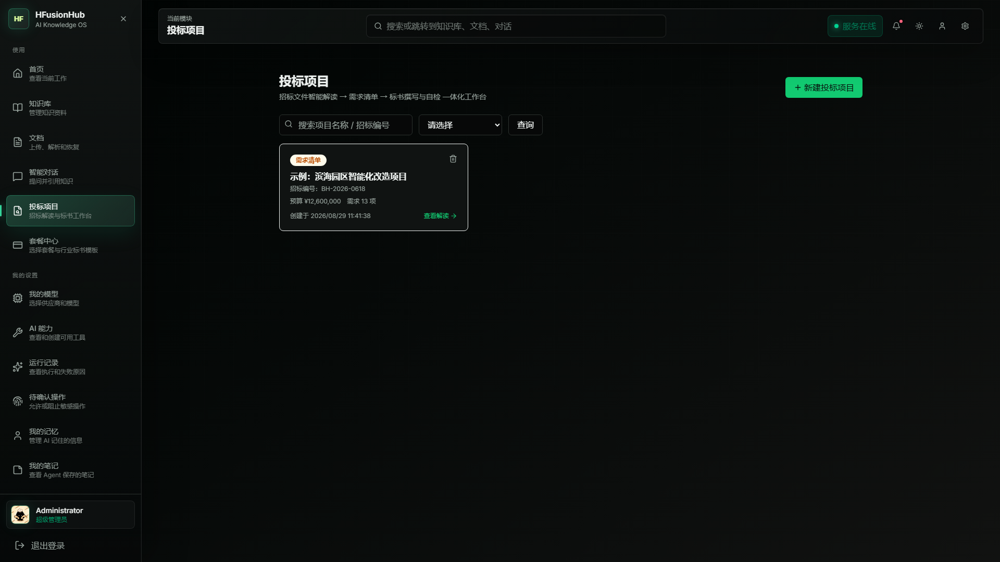

### 5.2 招标解读

AI 通读招标公告，抽取关键信息（重要时间节点、资质要求、评分办法、废标条款等）生成结构化解读报告，支持向 AI 追问细节。

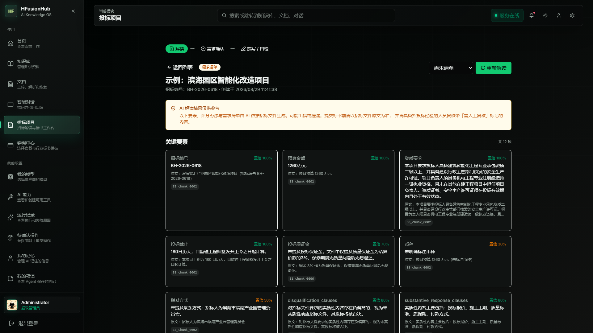

### 5.3 标书撰写

基于解读出的需求清单，AI 分章节生成标书草稿（绑定企业资质库/历史标书库作为素材），内置**废标自检**对照招标文件否决条款逐项核查草稿。

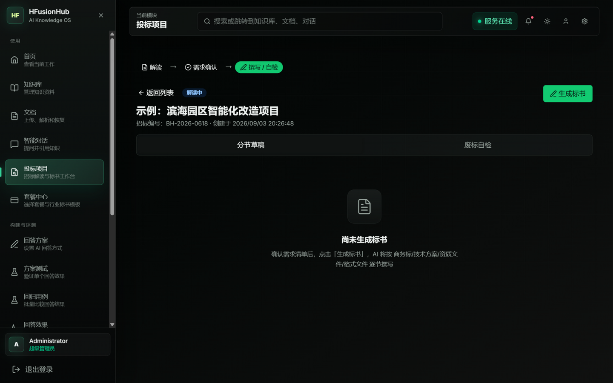

### 5.4 套餐中心

用户侧订阅视图：查看可订阅套餐、当前绑定、各模块（招标解读/标书撰写/废标自检）的开通状态与用量额度。

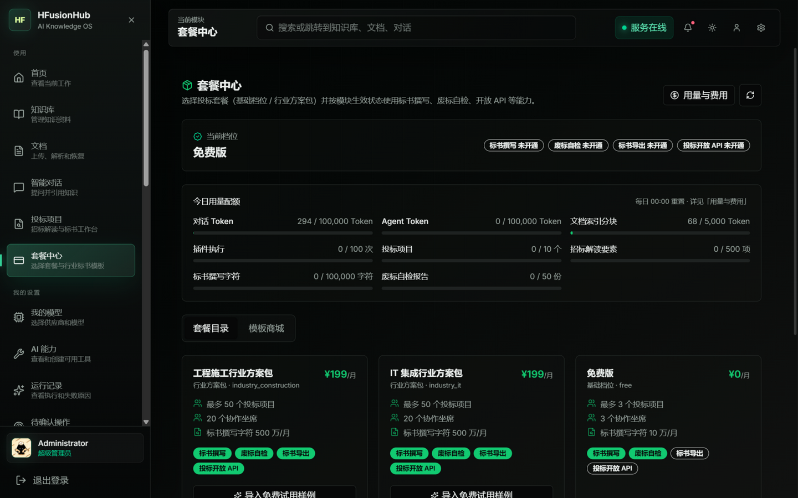

**怎么用**：新建投标项目 → 粘贴招标公告 → AI 解读 → 确认需求清单 → 一键生成标书草稿 → 废标自检 → 导出。未订阅模块时页面会引导到套餐中心开通。

## 6. AI 构建工具

面向 builder/管理员的能力配置与评测工具集。

### 6.1 我的模型

配置各用户可用的 LLM 供应商（DeepSeek/Ollama/OpenAI 兼容）与模型参数，支持用户级覆盖系统默认、按对话切换。页面同时展示系统级检索/多模态能力状态。

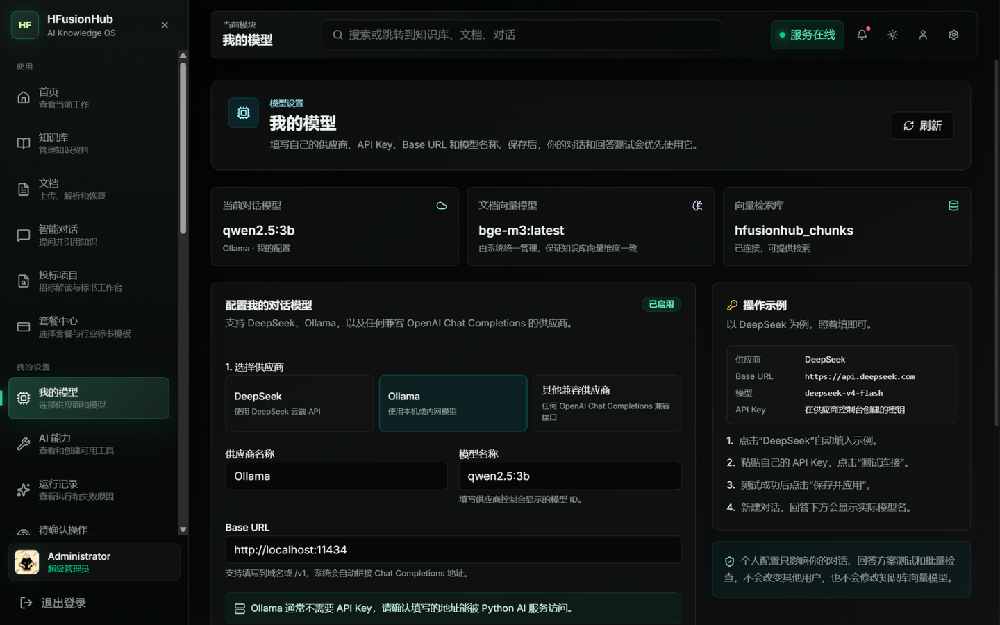

### 6.2 AI 能力（工具注册表）

查看/创建 AI 可调用的工具（内置检索类工具 + 自定义 MCP 工具），含风险等级、调用记录与审批要求。

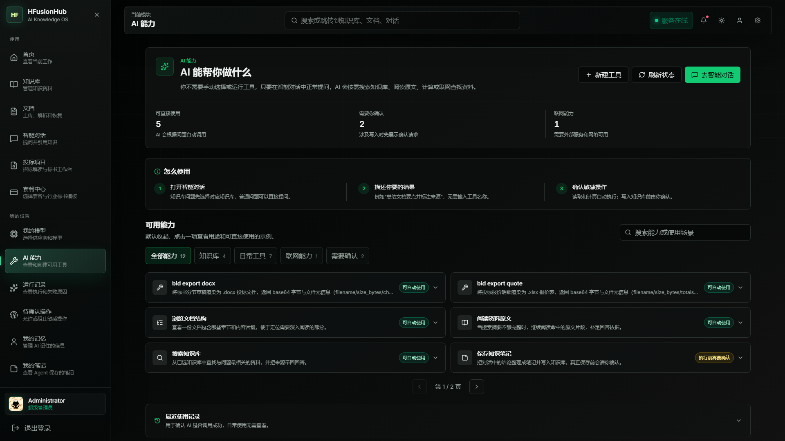

### 6.3 回答方案（提示词模板）

以"方案"管理 AI 的回答方式：草稿 → 测试 → 发布 → 回归验证的生命周期。发布后的方案可在新建对话时选用，控制回答的语气、结构、边界。内置客服答疑/文档总结/代码审查三个示例。

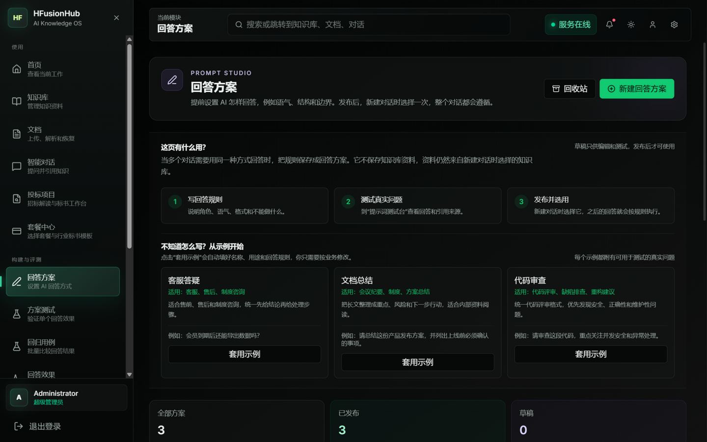

**怎么用**：新建方案 → 编写提示词（支持变量）→ 保存草稿 → 到「方案测试」单条试跑 → 满意后发布 → 在对话中选用。

### 6.4 方案测试

对单个已发布方案做快速试跑：输入测试问题，实时查看回答效果，用于发布前的验证。

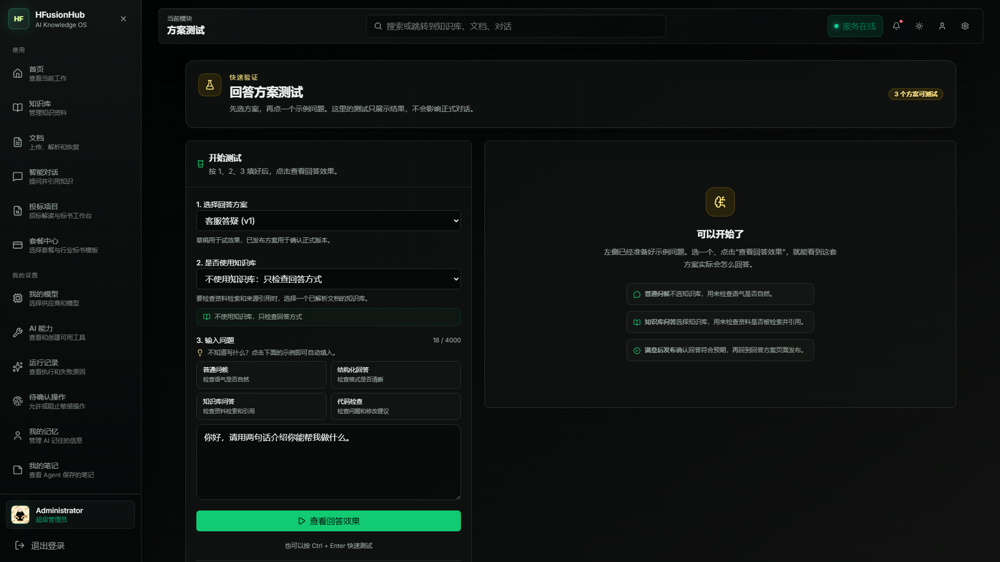

### 6.5 回归用例（批量评测）

把"问题 + 期望要点"组成测试集，批量跑多份回答方案并对比得分，回答方式调整后做**回归验证**防止效果劣化。支持异步队列执行与结果导出。

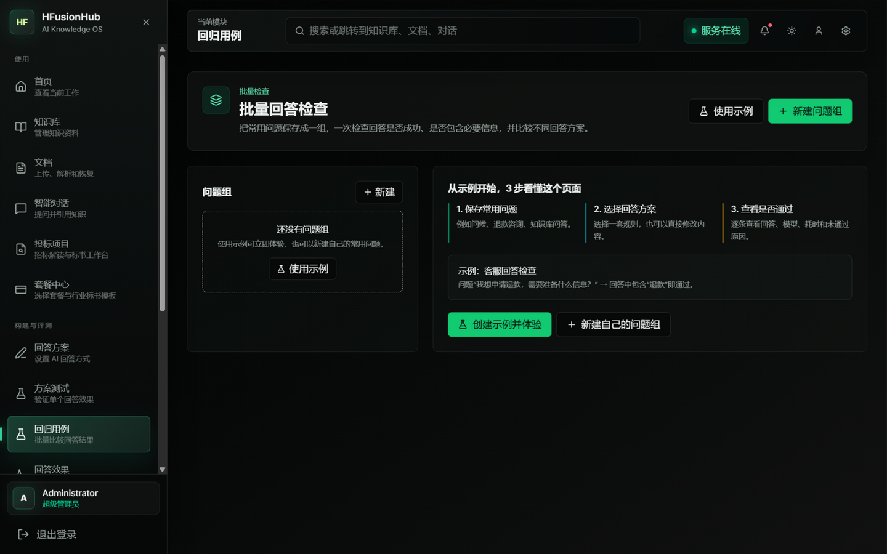

### 6.6 回答效果（检索与回答观测）

RAG 质量观测台：检索 trace（每问走了哪些通道、召回哪些片段、得分）、回答评估分数、用户反馈汇总。回答质量下降时从这里定位是**检索没召回**还是**生成跑偏**。

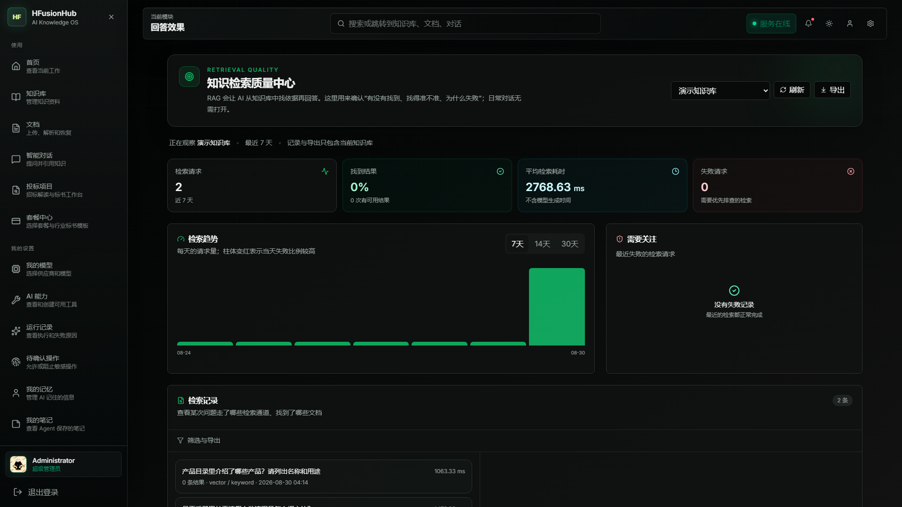

### 6.7 应用发布

把知识库打包为对外 API 应用（生成 API Key、绑定知识库与方案），供外部系统以 OpenAPI 风格接入问答能力。

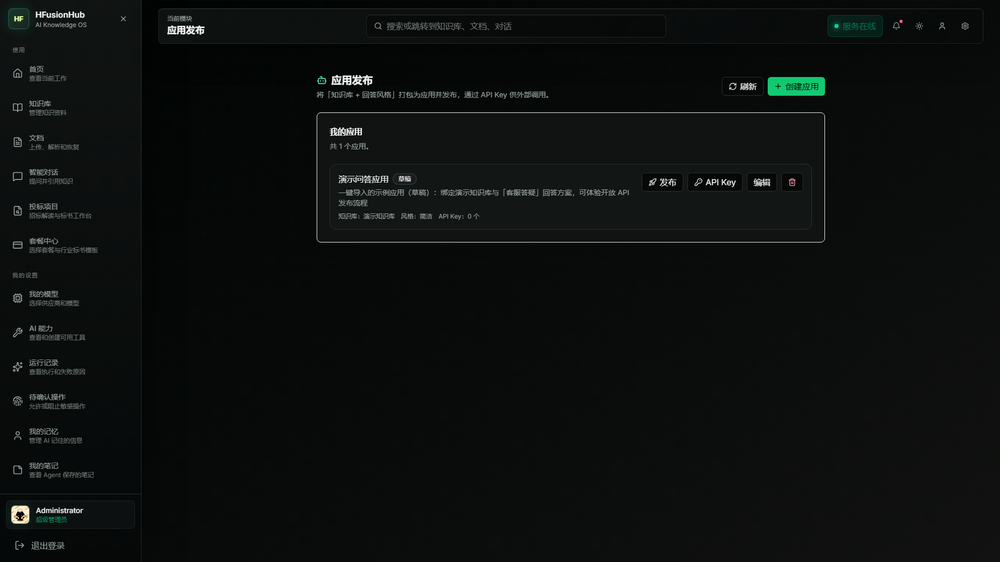

### 6.8 MCP 服务

接入外部 MCP（Model Context Protocol）工具服务器：配置连接与令牌、同步工具列表、测试连通性。接入的工具会出现在「AI 能力」中供 Agent 调用。

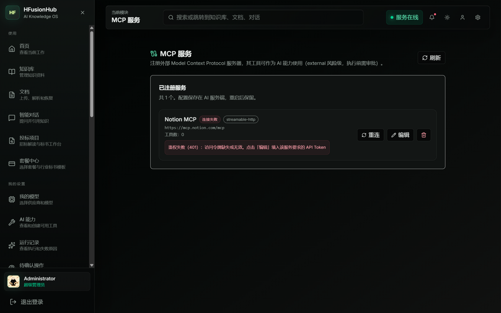

### 6.9 插件管理

平台插件的安装与管理：上传签名的插件 wheel 包（digest 校验）、在独立隔离 runner 中执行（网络/资源受限沙箱）、启用停用与租户可见性。内置标书 docx/报价单插件。

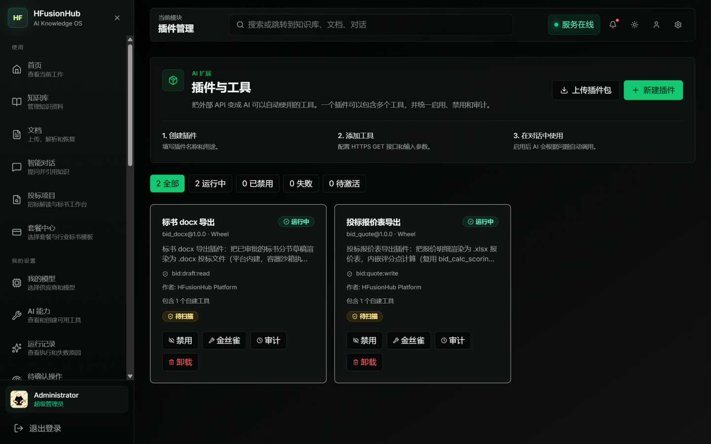

> 插件执行依赖 plugin-runner 服务（需配置 `PLUGIN_RUNNER_TOKEN`）；未部署时本页 fail-closed 显示不可用，属预期安全设计。

## 7. 运行与观测

### 7.0 运营分析大屏（分析扩展包）

「运营分析」页面（/analytics）：平台运营数仓的统一视图——概览四卡片（近 N 天调用 / Token 用量 / 累计成本 / 实时速率）、每日成本趋势柱状图、模型成本占比、Agent 步骤成功率、评测质量趋势、实时指标表（1 分钟窗口，30 秒自动刷新）。数据来自 HFusionData Analytics 扩展包（Spark 日结 + Flink 实时聚合，详见 docs/BIGDATA_ARCHITECTURE.md）；租户隔离在服务端强制（普通用户仅本租户），扩展包未部署时页面显示空态而非报错。

### 7.1 运行记录

Agent 任务的执行历史：每次运行的模型、工具调用次数、Token 用量、失败原因（超时/工具错误/连接失败）、重试与死信状态，支持查看单次运行的步骤明细。

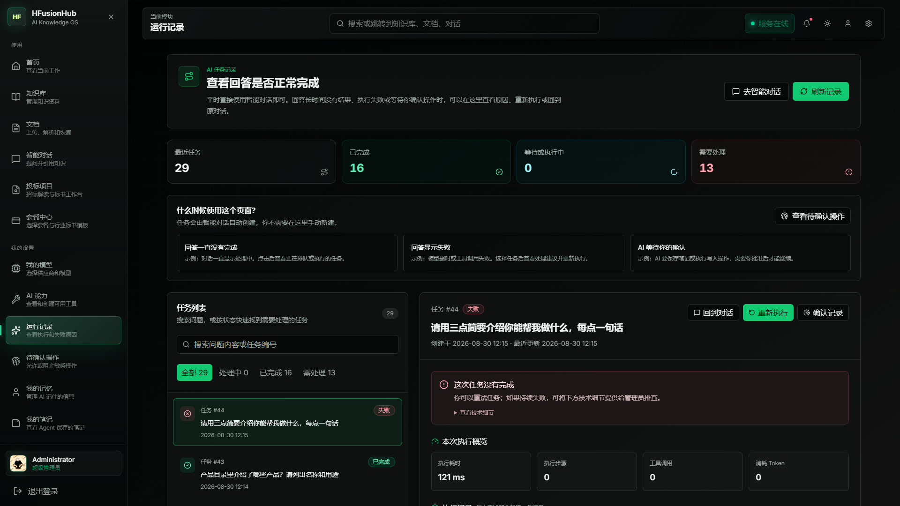

> 依赖 AI 能力开关（`agent.enabled`，默认关闭）；在「能力开关」开启后使用。

### 7.2 待确认操作

**人在回路的审批中心**：Agent 请求执行敏感工具（如写笔记）时暂停并生成审批单，展示工具名、风险等级与参数摘要；管理员批准或拒绝后任务继续/终止。实时 SSE 推送新审批。

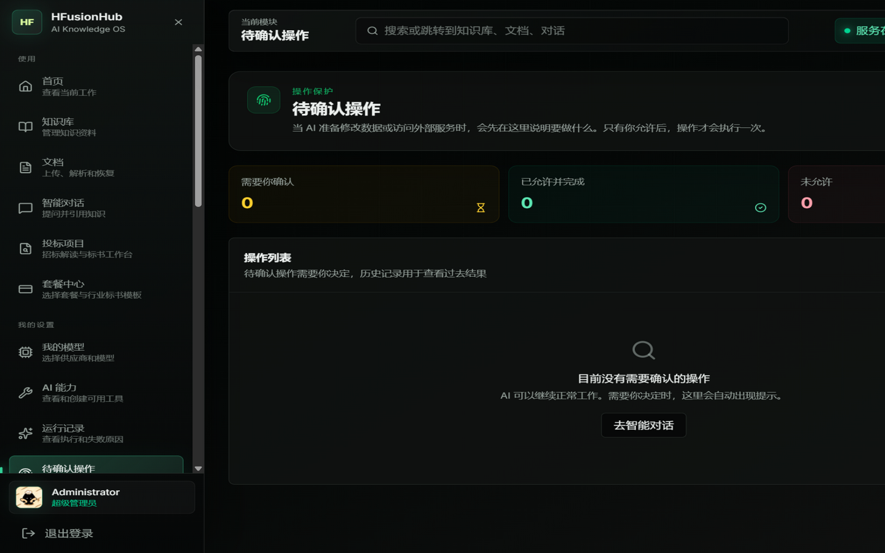

### 7.3 模型用量

用量账本可视化：总费用/Token/请求数、每日趋势、模型占比、**今日配额**（各资源日限额进度条，超限请求被拒）、逐条调用明细。费用为估算值（按 token 单价折算）。

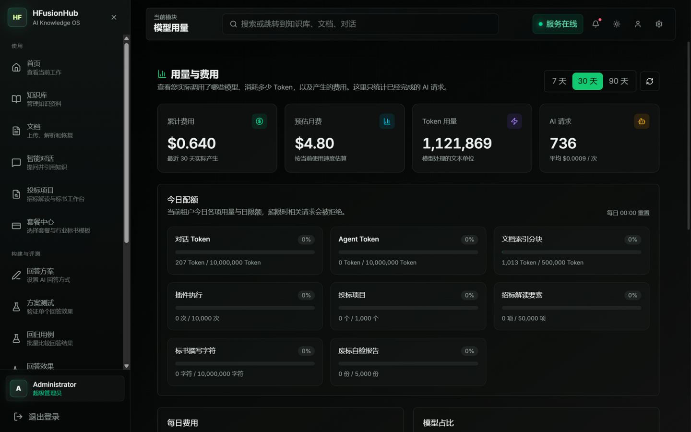

## 8. 记忆与笔记

### 8.1 我的记忆

AI 的长期事实记忆（"用户偏好"、"关键实体"）：手动添加，或在对话中让 AI 记住（"记住我喜欢简洁回答"）。记忆注入后续对话，使回答更个性化。支持查看/编辑/删除。

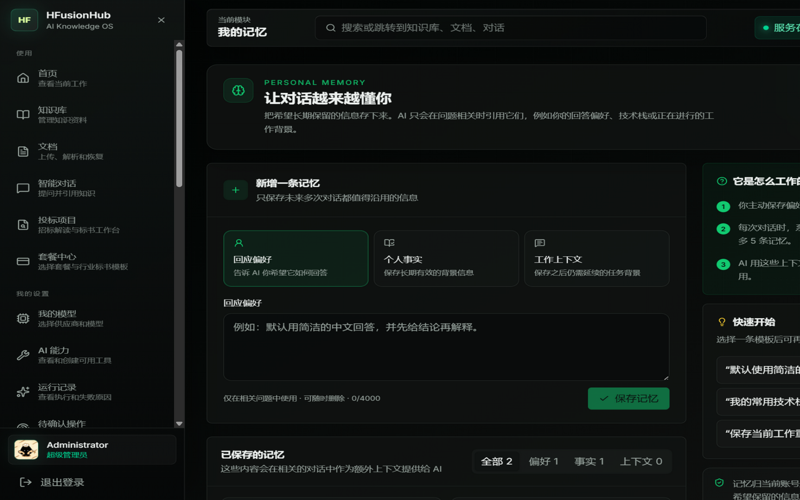

### 8.2 我的笔记

Agent 的结构化笔记本：手动创建，或 Agent 在执行任务时自动沉淀（`write_note` 工具，需审批）。可按来源（手动/Agent）筛选，支持公开/私有。

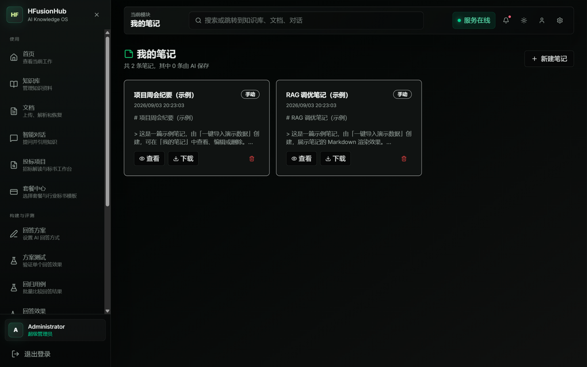

## 9. 系统管理（管理员）

以下页面仅 admin 角色可见。

### 9.1 能力开关

平台 AI 能力的总闸（feature flags）：Agent/多角色协作/联网搜索/多模态解析/重排模型等，三态（开/关/跟随环境默认）实时生效。**默认关闭的 Agent 能力开启后，「运行记录」「待确认操作」及 AI 自动笔记/记忆才会投入使用。**

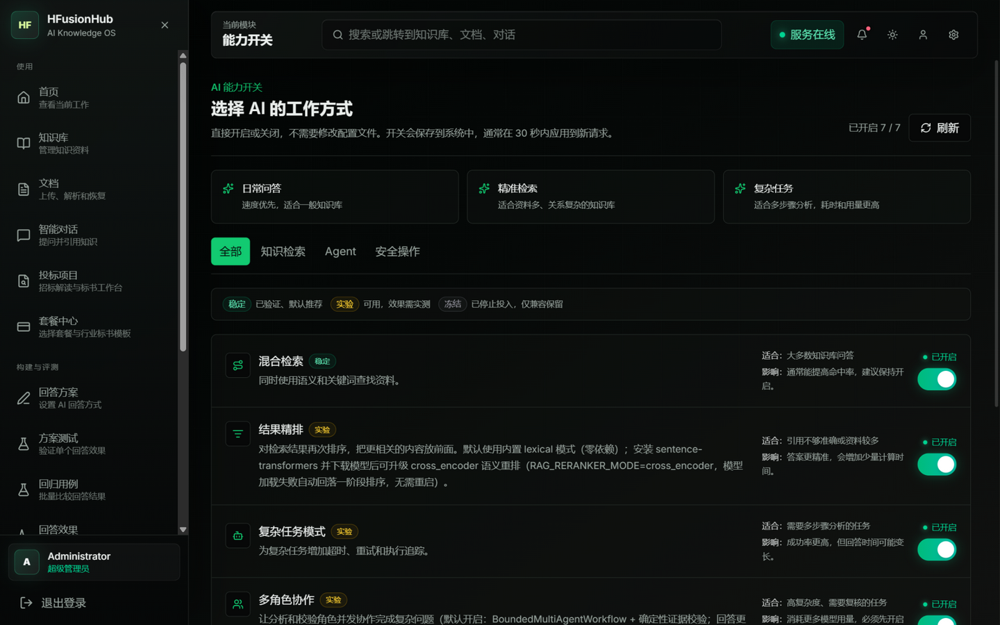

### 9.2 问题分流（意图路由）

为不同业务问题配置不同的知识库路由：树形意图分类（如"售后问题 → 售后知识库"），命中后该类问题自动检索对应知识库，提升多知识库场景的回答精度。

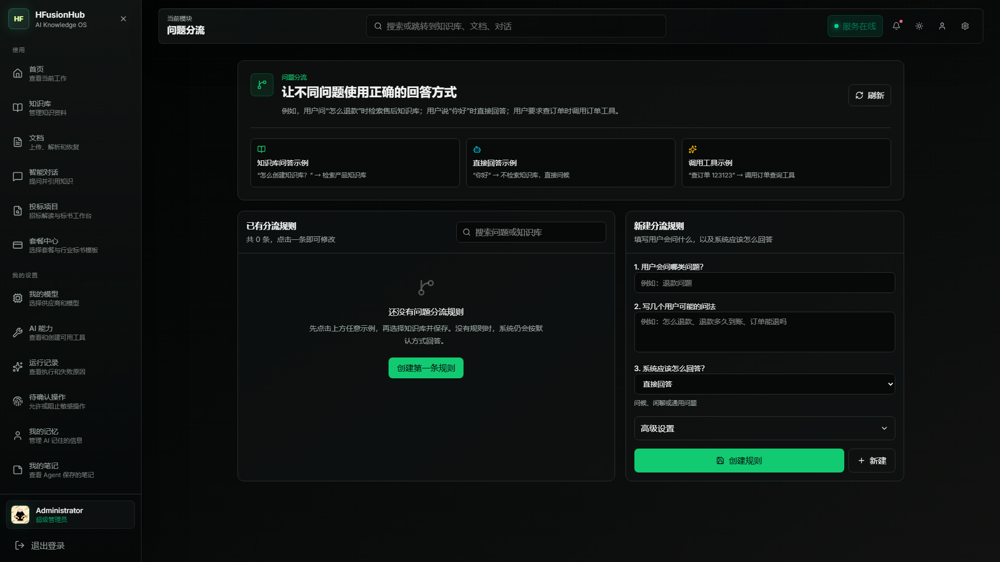

### 9.3 账号权限

用户生命周期管理：查看注册用户、分配身份（普通用户/构建者/超级管理员）、禁用启用、**重置密码**（忘记密码流程的管理端）。新注册用户默认 pending，需在此分配身份后才能使用业务功能。

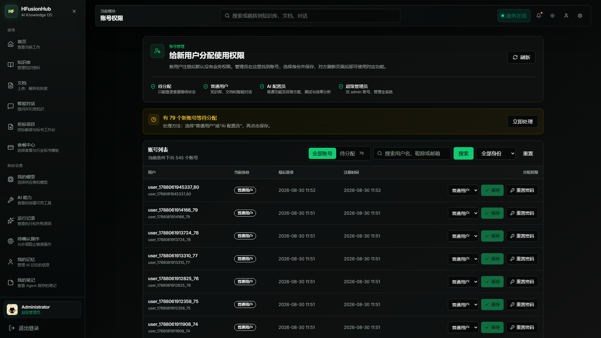

### 9.4 公告管理

发布系统公告（含生效时间与级别），全员在界面内接收通知与已读跟踪。

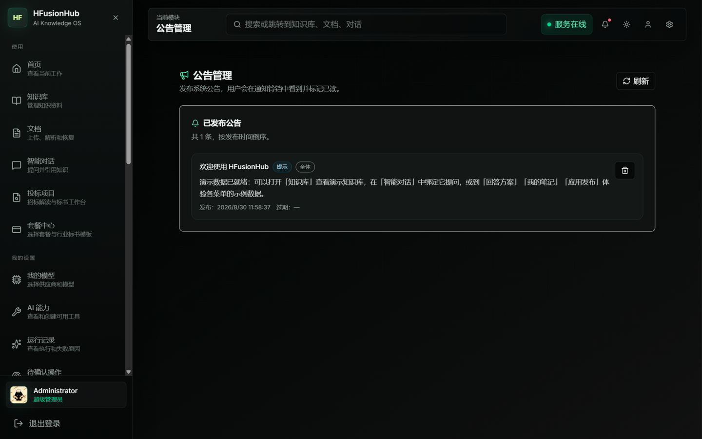

### 9.5 审计日志

敏感操作与跨租户审计记录：登录、审批、删除、配置变更等按动作类型着色的时间线，支持筛选与导出，满足安全合规审查。

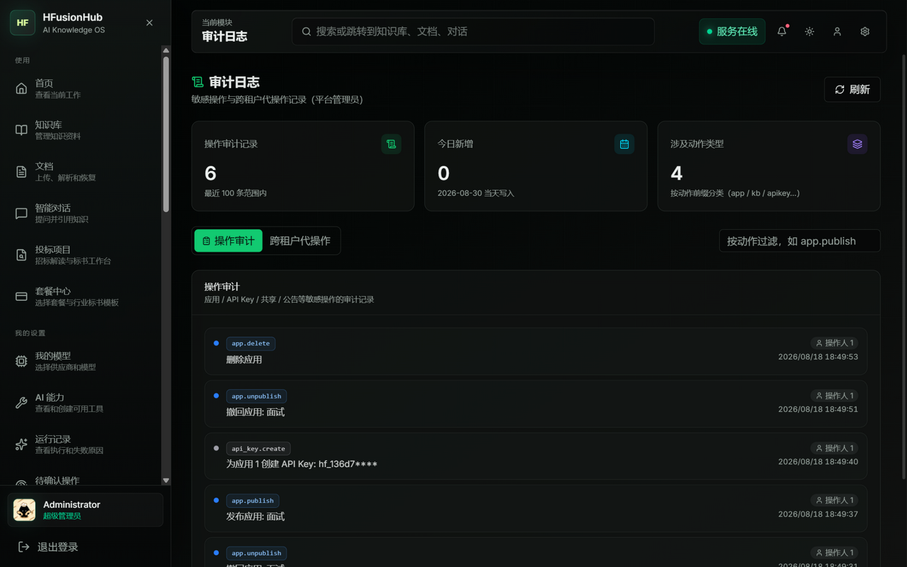

### 9.6 套餐管理

套餐目录 CRUD：定义套餐包含的模块（解读/撰写/自检）与用量额度，绑定行业标书模板包；与「套餐中心」构成管理端/用户端配对。

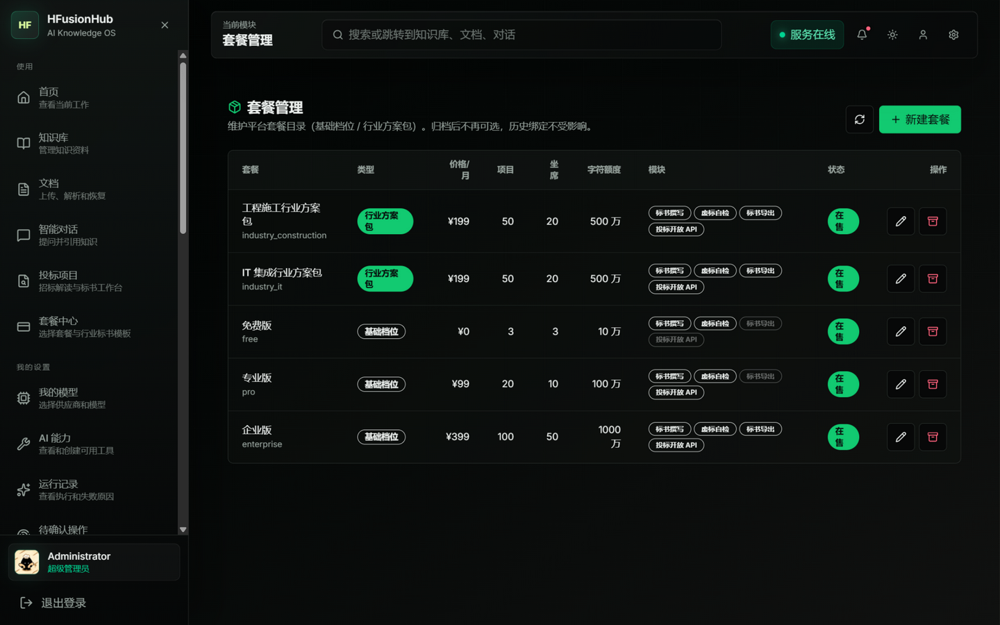

## 10. 设置与个人中心

### 10.1 设置

个人偏好中心：**主题切换**（浅色/深色/跟随系统，偏好持久化到服务端跨设备同步）、Webhook 通知配置、界面偏好。

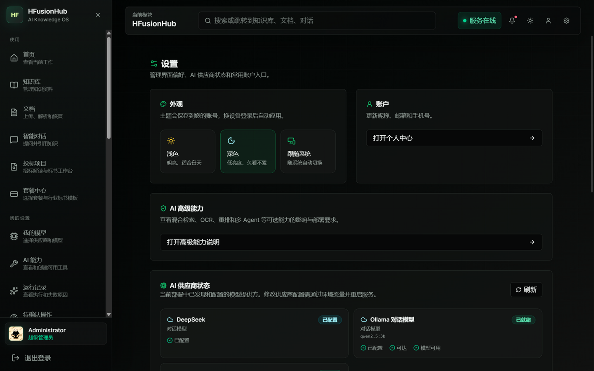

### 10.2 个人中心

身份概览与账户安全：渐变头像（点击上传，JPG/PNG/WEBP/GIF ≤2MB）、角色与账户状态徽标、注册/最近登录时间；个人信息（昵称/邮箱/手机号）编辑；修改密码。

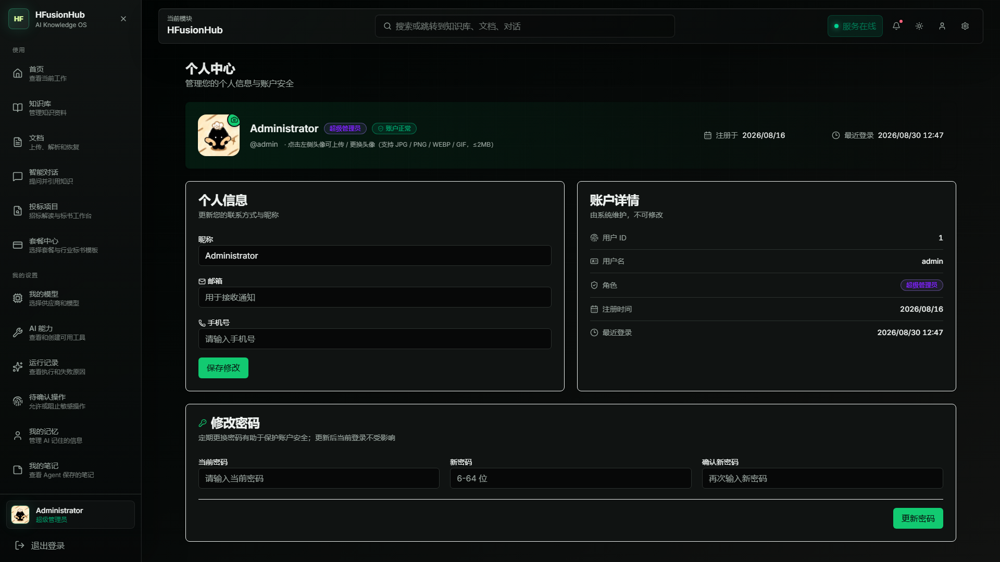

---

## 附：权限角色速查

| 能力 | 普通用户 | 构建者 | 超级管理员 |
|------|:---:|:---:|:---:|
| 知识库/文档/对话/笔记/记忆 | ✓ | ✓ | ✓ |
| 回答方案/测试/回归/应用/MCP | 阅读 | ✓ | ✓ |
| 投标项目/套餐中心 | 按订阅 | 按订阅 | 按订阅 |
| 能力开关/问题分流/账号/公告/审计/套餐管理 | — | — | ✓ |
| 演示数据导入/清除 | — | — | ✓ |
